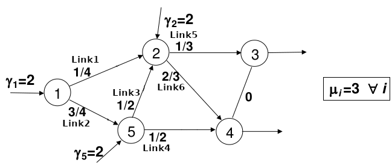
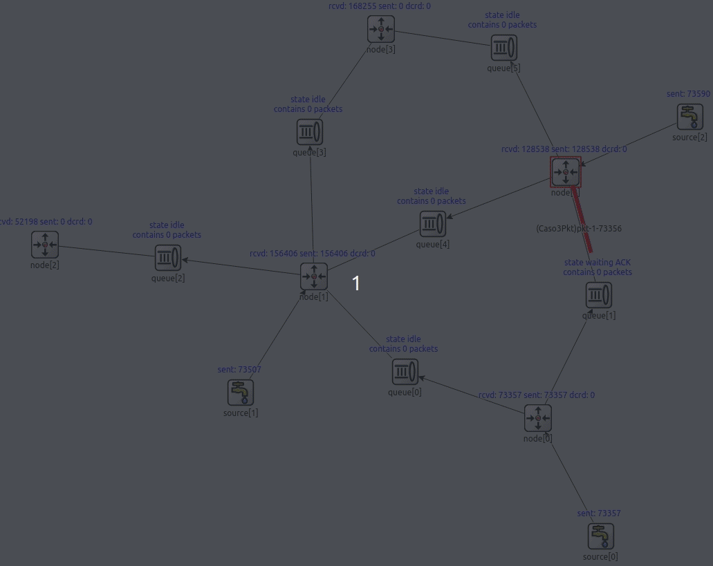
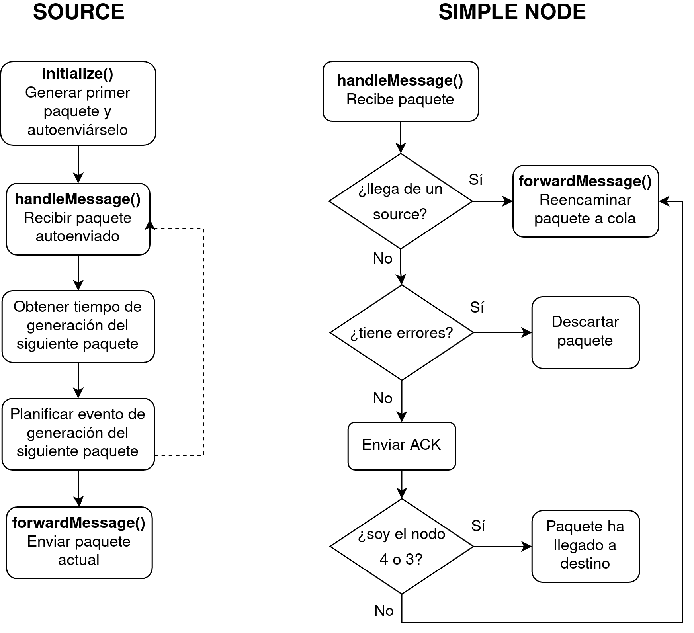
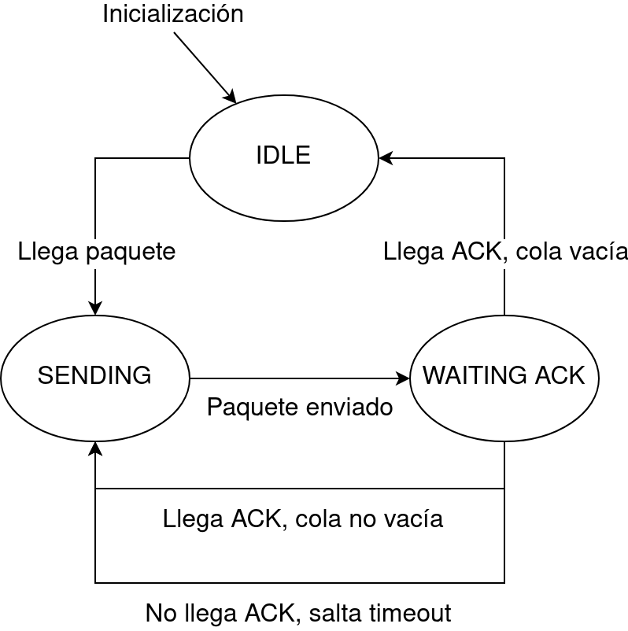
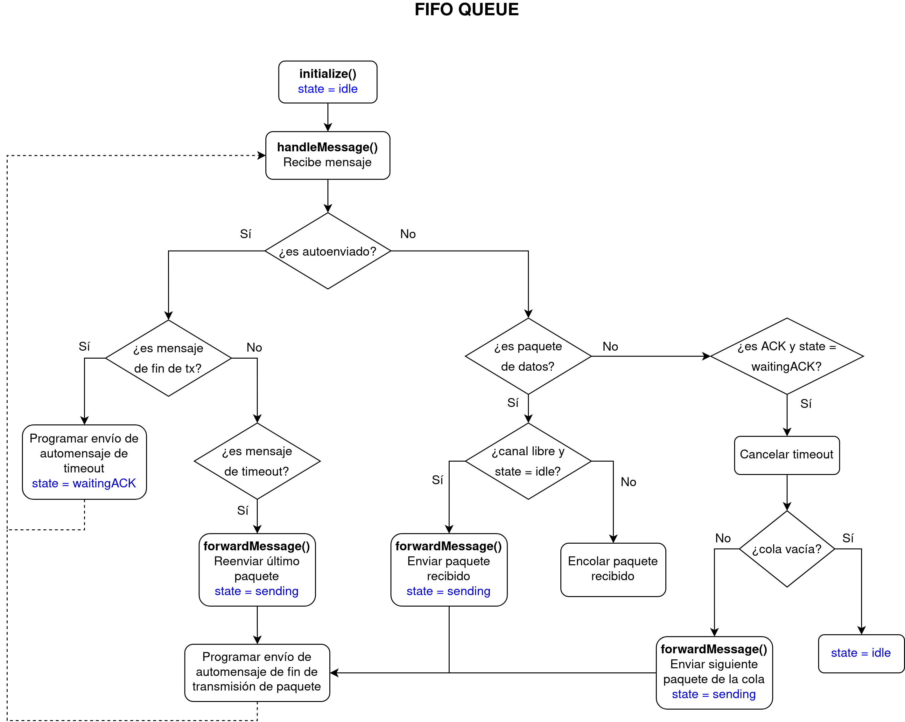
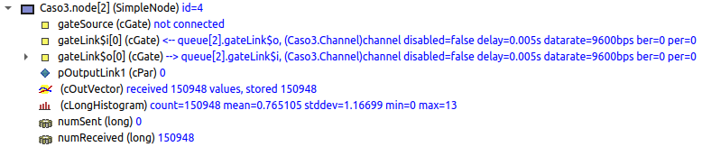
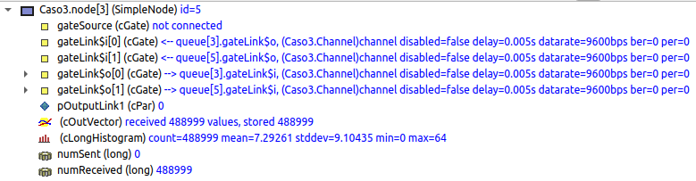

  

# Simulación del protocolo Stop & Wait con OMNeT++

Alumna: Cristina de Francisco Calvo

En este repositorio se recoge el código para realizar la simulación del caso 3 de la asignatura Rendimiento en Redes de Telecomunicación, del 2.º curso del Máster Universitario en Ingeniería de Telecomunicación de la UPV/EHU (Escuela de Ingeniería de Bilbao).

El principal objetivo era simular equipos de transmisión en redes bajo protocolo ARQ, más concretamente mediante un procedimiento de transmisión de paquetes Stop & Wait.

## Esquema de red general

En las siguientes imágenes se muestra el esquema general de la red, de forma teórica en el primero y de forma simulada en el segundo.

  
  

Como se puede observar, se tienen 3 tipos de elementos:
* Fuentes que generan los paquetes y los insertan en la red con una tasa lambda.
* Nodos que reciben paquetes y, si no son un nodo final, los reenvían por uno de sus enlaces de salida, en base a una distribución de Bernoulli con probabilidades.
* Colas FIFO, que van unidas a los nodos, que simulan la multiplexación y el protocolo Stop & Wait.

Además, se ha utilizado la clase DatarateChannel para simular los enlaces.

## Formato de paquete

Se ha definido un nuevo paquete con los siguientes campos:

| Campo          | Tipo       | Descripción                    |
|----------------|------------|--------------------------------|
| initTime       | simtime_t  | Tiempo de creación del paquete |
| flowId         | int        | ID del flujo al que pertenece  |
| flowSeqNum     | int        | Número de secuencia del flujo  |
| linkSeqNum     | int        | Número de secuencia del enlace |
| hopCount       | int        | Número de saltos               |

## Datos de la simulación

Los datos utilizados para la simulación son los mostrados en la siguiente tabla:

| Campo                          | Valor                     |
|--------------------------------|---------------------------|
| &#955;                         | 2 paquetes/s              |
| Tasa de servicio, &#956;       | 3 paquetes/s              |
| Capacidad de los enlaces, C    | 9600 bps                  |
| Longitud media de los paquetes | C / &#955; = 3200 bits    |
| Timeout                        | 500 ms                    |
| Tiempo de propagación          | 5 ms                      |
| PER (Packet Error Rate)        | 1e-5                      |
  

La longitud de los paquetes sigue una distribución exponencial, con la media mostrada en la tabla. El tiempo de generación entre un paquete y otro tiene también una distribución exponencial, con media 1/&#955;.

## Diagramas de flujo de cada elemento de red

En el siguiente diagrama de flujos se muestra el procedimiento seguido por los elementos "source" y "simple node":

  

Las colas "FIFO queue" tienen 3 estados: idle (en espera), sending (enviando un paquete) y waitingACK (esperando un ACK). En las siguientes imágenes se muestran un diagrama de estados y otro de flujos:

  

  

## Resultados

Una de las estadísticas que se ha recogido es el delay de los paquetes desde que son generados hasta que llegan a uno de los dos nodos finales (el 3 y el 4). Para calcular el delay de cada paquete, al generarlo se ha guardado en él un campo "initTime", con el tiempo de creación, y a la llegada a uno de los nodos finales se ha registrado el delay como la diferencia entre el tiempo de simulación de llegada y el tiempo de creación. 

Se ha utilizado un objeto Histograma de OMNeT++, que calcula la media de dicho rertardo. En las siguientes imágenes se muestra cómo, después de 100 000 segundos de simulación, el retardo medio converge a **0,765 segundos** para el nodo 3 y **7,29 segundos** para el nodo 4.

  
  

