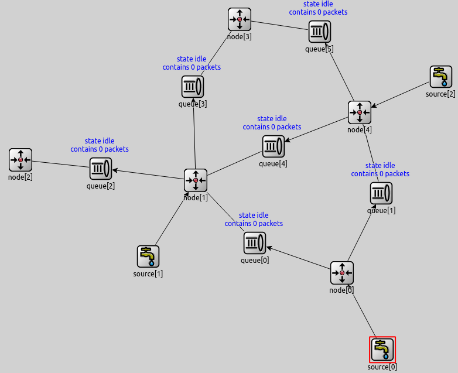

  

# Simulación del protocolo Stop & Wait con OMNeT++

Alumna: Cristina de Francisco Calvo

En este repositorio se recoge el código para realizar la simulación del caso 3 de la asignatura Rendimiento en Redes de Telecomunicación, del 2.º curso del Máster Universitario en Ingeniería de Telecomunicación de la UPV/EHU (Escuela de Ingeniería de Bilbao).

El principal objetivo era simular equipos de transmisión en redes bajo protocolo ARQ, más concretamente mediante un procedimiento de transmisión de paquetes Stop & Wait.

## Esquema de red general

  

## Diagramas de flujo de cada elemento de red

En el siguiente diagrama de flujos se muestra el procedimiento seguido por los elementos "source" y "simple node"

  

En el siguiente diagrama de flujos se muestra el procedimiento seguido por las colas "FIFO queue":

  

